<div align="center">



<br/>


<br/><br/>

[](mailto:hiyumidilmani2002@gmail.com)
[](https://github.com/dilmani773)
[](https://github.com/dilmani773)
[](https://github.com/dilmani773)

</div>

---

## `> whoami`

<table>
<tr>
<td width="55%" valign="top">

I'm drawn to the **mathematics behind intelligent systems** — not just running models, but understanding why they work. Gradient descent, backpropagation, convolutions — I want the intuition, not just the API.

I can take an idea **from model to deployed app** — data pipelines, training the system, and shipping it as something real. Math-first thinking, full-stack execution.

</td>
<td width="45%" valign="top">

| | |
|---|---|
| 🎓 | Computer Engineering @ Uni of Peradeniya |
| 🔭 | ML · Deep Learning · Computer Vision |
| ∑ | Loves maths more than most people love anything |
| 🌍 | Sri Lanka 🇱🇰 |
| 🚀 | Building intelligent systems end-to-end |

</td>
</tr>
</table>

---

## `> ./stack.sh`

<div align="center">

**🧠 AI / ML**


**⚡ Frontend**


**🔩 Backend & Languages**


**🔧 DevOps & Tools**


</div>

---

## `> echo $PHILOSOPHY`

```
╔══════════════════════════════════════════════════════════════╗
║                                                              ║
║   Neural networks are compositions of functions.             ║
║   Training is gradient descent in a loss landscape.          ║
║   Attention is a weighted dot-product query.                 ║
║                                                              ║
║   I prefer to understand  WHY  before I use  HOW.            ║
║   That's what separates engineers from practitioners.        ║
║                                                              ║
╚══════════════════════════════════════════════════════════════╝
```

---

## `> cat github-stats.log`

<div align="center">


</div>

<div align="center">


</div>

---

## `> ls ./activity`

<div align="center">


</div>

---

## `> ping me`

<div align="center">

| Channel | Link |
|:-------:|:----:|
| Email | [e21453@eng.pdn.ac.lk](mailto:e21453@eng.pdn.ac.lk) |
| GitHub | [github.com/dilmani773](https://github.com/dilmani773) |

<br/>


</div>

---

<div align="center">

```
╔══════════════════════════════════════════════════╗
║  "Understand the math. Master the model."        ║
║                               — Hiyumi           ║
╚══════════════════════════════════════════════════╝
```

*Building at the intersection of mathematics and intelligent systems.*

</div>
